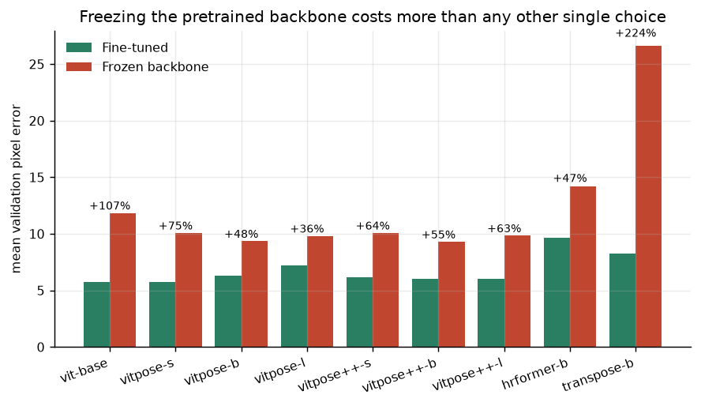
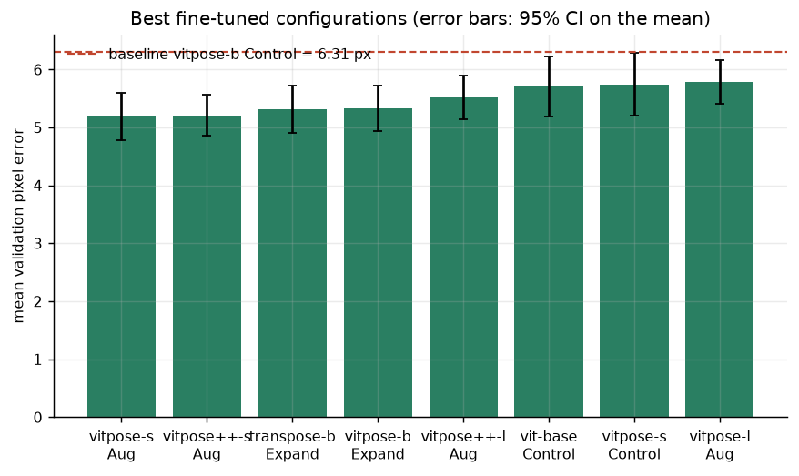
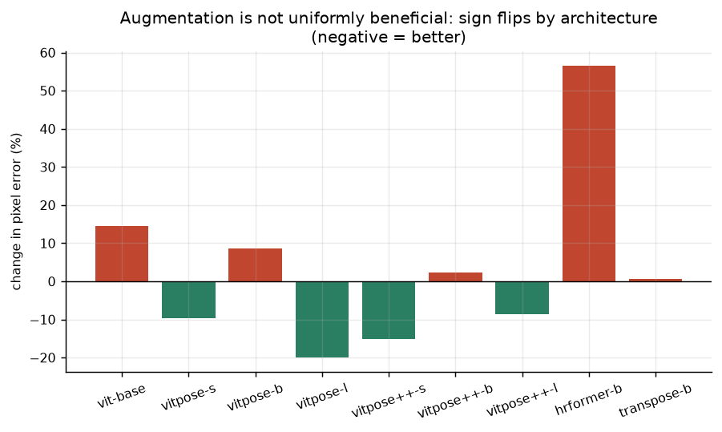
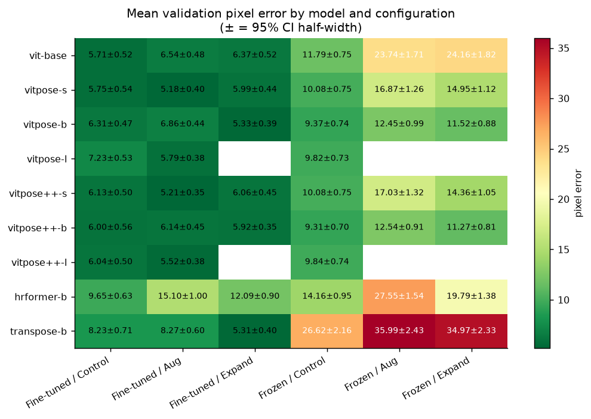

# Vision Transformers for cervical-vertebra landmark localisation

[](https://github.com/rmonteiro-pereira/vit-vertebrae-pose/actions/workflows/ci.yml)
[](https://www.python.org/downloads/)
[-green.svg)](LICENSE)

A controlled benchmark of Vision Transformers for localising two cervical-spine
landmarks in lateral videofluoroscopy frames. **169 archived training runs, 20,098
epochs, collapsed into a nine-model x six-configuration grid with 48 of its 54 cells
filled**, with 95% confidence intervals on every reported error and a single
traceable run hash behind every number. Seven of the nine labels are the Vision
Transformer backbones this repository ships, and every claim below rests on those
seven; the remaining two are reported for completeness and excluded from all of them
(§5, and [`docs/limitations.md`](docs/limitations.md) §3).

**The dataset is licensed medical imaging and is not in this repository.** It is
third-party research data under **Creative Commons BY-NC-SA 3.0**, together with its
host's ground rules, which forbid re-posting it. No frame, and nothing derived from a
frame, is committed here. Everything else is: the code, the run archive, the
aggregation rules, the figures, and a CI job that fails the build if a radiograph
ever gets near the tree. [`docs/dataset.md`](docs/dataset.md) covers what the licence
permits and how to obtain the data yourself.

**Attribution is incomplete, and marked rather than guessed.** CC BY-NC-SA requires
naming the source. What the archived material supports is that the underlying
videofluoroscopy studies come from a public research repository of swallow studies
hosted within the TalkBank family of corpora. **The exact corpus, its authors and its
required citation are not established by anything in this repository, so they are not
stated here** — a wrong attribution would be worse than one marked incomplete.
Completing it is an open item in [`docs/dataset.md`](docs/dataset.md).

```bash
git clone https://github.com/rmonteiro-pereira/vit-vertebrae-pose
cd vit-vertebrae-pose && uv sync --all-extras
uv run pytest                                  # 243 tests, no GPU, no dataset
uv run python scripts/aggregate_results.py --check   # published numbers re-derived
uv run python scripts/make_figures.py                # every figure regenerated
```

---

## What was measured

Primary endpoint: **mean validation pixel error**, the mean over 297 validation frames
of the mean Euclidean distance between the two predicted and annotated landmarks, in
pixels of the network input. Baseline for every relative claim is `vitpose-b`
fine-tuned without augmentation, at **6.31 px**.

### 1. Freezing the pretrained backbone is the most damaging single choice — by a wide margin

Across all 23 cells where the same model and data policy were run both ways, freezing
was worse **every time**: **+35.7% at best, +104% at the median, +558% at worst**.
No other variable in the study comes close.



> `results/aggregated_metrics.json`, cells `Fine-tuned / *` vs `Frozen / *`.
> Asserted in `tests/test_results.py::test_frozen_backbone_is_worse_in_every_cell_where_both_exist`.

### 2. Scale does not buy accuracy here — the smallest model wins

| Model | Parameters | Best fine-tuned error |
|---|---:|---:|
| `vitpose-s` | 30.9 M | **5.18 ± 0.40 px** |
| `vitpose++-s` | 30.9 M | 5.21 ± 0.35 px |
| `vitpose-b` | 121.8 M | 5.33 ± 0.39 px |
| `vitpose++-l` | 429.9 M | 5.52 ± 0.38 px |
| `vitpose-l` | 429.9 M | 5.79 ± 0.38 px |

The defensible reading is the negative one: **a 14x parameter increase bought nothing
measurable.** With two landmarks, ~1,200 training frames and a strongly constrained
anatomy, capacity is not the binding constraint. The gaps *within* this table sit at or
below the measured noise floor (§4), so it establishes that scale did not help — not
that small is better.



> `results/aggregated_metrics.json → top_fine_tuned`. Parameter counts from the
> original repository's model audit, quoted in `docs/results.md`.

### 3. Augmentation helps or hurts depending on the architecture — the sign flips

| | `vitpose-l` | `vitpose++-s` | `vitpose-s` | `vitpose++-b` | `vitpose-b` | `vit-base` | `hrformer-b` |
|---|---:|---:|---:|---:|---:|---:|---:|
| Δ error with augmentation | **−20.0%** | −15.1% | −9.8% | +2.3% | +8.7% | +14.5% | +56.5% |



"Add augmentation" is not a free win. On this task it is a per-architecture decision,
and reporting a single pooled augmentation effect would have concealed a sign change.

### 4. The benchmark measures its own noise floor — and the noise wins

Because `vitpose-x` and `vitpose++-x` load identical weights (see below), their 15
shared cells are repeated measurements of one configuration under two labels. Their
mean paired difference is **−0.135 px** — no systematic effect, as expected. Their
**largest** paired difference is **1.196 px**.

The best fine-tuned cell beats the baseline by **1.124 px**.

**The run-to-run noise floor is larger than the headline effect.** The frozen-backbone
finding survives it comfortably (23/23 cells, up to +558%). The *ranking among
fine-tuned configurations does not*: 5.18 px cannot be said to beat 5.52 px at one seed
per cell.

This is asserted in
`tests/test_results.py::test_run_to_run_noise_floor_exceeds_the_best_versus_baseline_gap`,
not merely written down. Resolving it needs 3-5 seeds per cell and a between-seed
variance term.

### 5. The full grid



Every cell shows mean pixel error ± the 95% CI half-width. Blank cells were not run.
`hrformer-b` and `transpose-b` are reported for completeness but **must not be read as
evaluations of HRFormer or TransPose**: the original builders instantiate 9,536 and
9,600 parameters, three to four orders of magnitude below the published architectures.
See [`docs/limitations.md`](docs/limitations.md) §3.

---

## What this repository does *not* claim

Stated up front, because a benchmark that hides its confounds is worth less than one
that names them.

- **`vitpose-*` and `vitpose++-*` are the same network.** Original ViTPose checkpoints
  are not published on the Hub, so both families load `usyd-community/vitpose-plus-*`.
  At equal scale their parameter counts are byte-identical (30,895,749 / 121,820,421 /
  429,944,837). Any gap between them in the grid is run-to-run variance, not
  architecture — which is what makes them usable as the noise-floor estimate in §4.
- **Validation-only, single split, single site.** No held-out test set, no external
  validation, no demographics, no scanner metadata.
- **Errors are in pixels, not millimetres.** Without a per-study pixel-spacing table,
  no clinical tolerance can be stated. Nothing here supports a clinical claim.
- **Replicate selection is optimistic.** Where a cell holds several runs, metrics come
  from the run with the lowest validation loss. That biases every cell downward by an
  unmeasured amount.

The full list is in [`docs/limitations.md`](docs/limitations.md).

---

## A defect the archive proves

Three completed 100-epoch runs are recorded with `loss_type: cosine_similarity`. That
name was never in the loss registry. The original resolver responded to an unknown
name by printing a warning and **silently substituting the Euclidean loss**, so those
runs optimised a different objective than their metadata claims — roughly 300 epochs
of mislabelled evidence. The archive corroborates it: their validation losses land at
5.1–7.3, in the Euclidean range, while a cosine objective bounded at 2.0 could not
reach those values.

The public package raises `KeyError` instead:

```python
>>> get_loss_function("cosine_similarity")
KeyError: "unknown loss 'cosine_similarity'; available: adaptive_wing, cosine, ..."
```

Config keys behave the same way: an unrecognised field is a `ConfigError` at load
time, not a silently ignored typo. `docs/engineering.md` covers the other two defects
found while preparing this release.

---

## Reproducing the analysis

No GPU, no dataset, no network:

```bash
uv sync --all-extras
uv run pytest                                        # full suite
uv run python scripts/aggregate_results.py --check   # grid matches the committed file
uv run python scripts/make_figures.py                # figures/ regenerated
```

`--check` re-derives all 48 cells from `results/runs.jsonl` and exits non-zero on any
difference, so the published numbers cannot drift from the evidence. CI runs it on
every push.

## Reproducing the training

Requires the licensed dataset. Read [`docs/dataset.md`](docs/dataset.md) first — it
covers what the data is, what its licence permits, and how to obtain it yourself.

```bash
uv sync --extra train
uv run python scripts/train.py \
    --config experiments/smoke_test.yaml \
    --data-root /path/to/dataset/fold1 \
    --output runs/smoke
```

Expected layout under `--data-root`:

```
fold1/
├── train/
│   ├── images/    frame.jpg ...
│   └── labels/    frame.txt ...   # <class> <cx> <cy> <w> <h> <x1> <y1> <v1> <x2> <y2> <v2>
└── valid/
    ├── images/
    └── labels/
```

Then `experiments/best_vitpose_s_aug.yaml` for the full 100-epoch best configuration.

---

## Repository layout

```
src/vitvert/
├── statistics.py        confidence intervals (exact Student-t + bootstrap)
├── losses.py            10 keypoint objectives, uniform visibility masking
├── metrics.py           pixel error, PCK; aggregated per image, not per landmark
├── config.py            validated experiment configuration
├── training.py          single-fold training loop
├── data/                annotation parsing, keypoint-aware augmentation, dataset
├── models/              vit-base + 6 ViTPose variants
└── results/             run archive loader and the published aggregation rules
scripts/                 aggregate_results.py · make_figures.py · train.py
tools/export_runs.py     the one bridge from the private research repo
results/runs.jsonl       169 runs, metrics only
figures/                 committed charts, regenerated by make_figures.py
docs/                    architecture · dataset · results · engineering · limitations · adr/
```

## Documentation

| | |
|---|---|
| [`docs/dataset.md`](docs/dataset.md) | What the data is, what its licence permits, how to obtain it |
| [`docs/results.md`](docs/results.md) | Full grid, aggregation rules, evidence chain |
| [`docs/architecture.md`](docs/architecture.md) | How the package fits together, and why |
| [`docs/engineering.md`](docs/engineering.md) | Measured training-throughput and I/O work, with the projections labelled |
| [`docs/limitations.md`](docs/limitations.md) | Everything this benchmark does not establish |
| [`docs/adr/`](docs/adr/) | Decision records, each with the rejected alternative |
| [`SECURITY.md`](SECURITY.md) | The data-handling posture and how to report a leak |
| [`CONTRIBUTING.md`](CONTRIBUTING.md) | Setup, tests, and the rules that are not negotiable |

## Provenance

This is a clean public release of a private graduate research repository
(PUC-Rio, INF2008). The private repository retains the dataset, the model weights and
the full development history. Nothing derived from patient imagery crossed over: the
only bridge is [`tools/export_runs.py`](tools/export_runs.py), which exports an
allowlisted set of metric fields and nothing else.

The training loop here is a distilled replacement for three overlapping orchestrators
in the original code. It reproduces the *procedure*, not the archived numbers
bit-for-bit; the archived numbers were produced by the original code and are shipped
as data. The aggregation path, by contrast, is verified: the reimplementation
reproduces all 48 published cells and every metric to the last decimal.

## Licence

MIT — **code only**. It grants no rights to the dataset or to third-party pretrained
weights. See [`LICENSE`](LICENSE).
